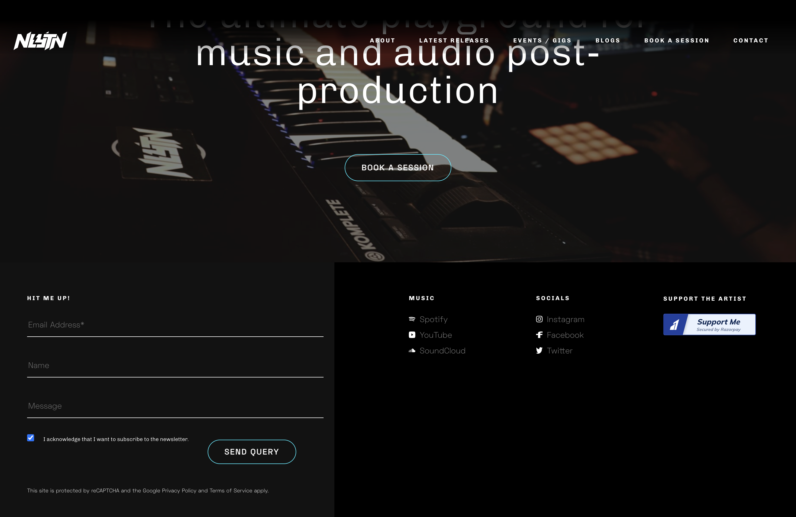

# Artist Studio Portfolio Website

An open-source Django-based website template, originally developed for nlytnmusic (Siddhesh Parekh). This project
provides musicians with a platform to showcase their work, manage events, share blog posts, and rent out their music
studios. The website was live from 2020 to 2023 and can be viewed via the [archived link](https://web.archive.org/web/20220210082301/https://nlytnmusic.com/).

## Features

- **Song Showcase**: Display songs and albums with detailed descriptions.
- **Event Management**: Announce and manage bookings for upcoming events.
- **Blog Posts**: Share updates and thoughts with fans.
- **Studio Rentals**: Integrated system for renting out music studios.
- **SEO Friendly**: Dynamic sitemaps to improve search engine indexing.
- **Spotify Integration**: Input trackId from Spotify to generate a small Spotify preview player on the website.
- **Google reCAPTCHA**: Integrated reCAPTCHA for spam prevention in forms.
- **Payment Integration**: Allows for coffee donations and booking payments through Razorpay.
- **Dynamic Sections**: Sections on the site are dynamically hidden or shown based on the data inputted in the admin
  dashboard.

## Getting Started

These instructions will help you set up the project on your local machine for development and testing purposes.

Refer to [Setup_Instructions.md](Setup_Instructions.md) for detailed setup instructions.

### Prerequisites

- Python 3.x
- Django 5.x
- Virtualenv

### Configuration

1. **ASGI Configuration**:
   The ASGI configuration is located in `artist/asgi.py`. It exposes the ASGI callable as a module-level variable
   named `application`.

2. **Settings Configuration**:
   The settings are located in `artist/settings.py`. The key configurations include:
    - Environment Variables: Managed with `django-environ` to keep sensitive information secure.
    - Installed Apps: Lists all Django applications and third-party apps used in the project.
    - Middleware: Includes security, session, authentication, and other middleware.
    - Database: Configured with SQLite by default, can be switched to PostgreSQL or other databases.
    - Static and Media Files: Configured paths for handling static and media files.

   Refer to `example.env` for environment variables setup in `.env`.

3. **Sitemaps Configuration**:
   Sitemaps are defined in `artist/sitemaps.py` to improve the site's SEO by helping search engines index the site more
   effectively.

### Connecting to External Services

To use an external database like AWS S3 bucket and PostgreSQL hosted on AWS, follow these steps:

1. **AWS S3 Bucket for Media Files**:
    - Install the `django-storages` package:
        ```bash
            pip install django-storages[boto3]
        ```
    - Update your `settings.py`:
        ```python
      DEFAULT_FILE_STORAGE = 'storages.backends.s3boto3.S3Boto3Storage'
      AWS_ACCESS_KEY_ID = env('AWS_ACCESS_KEY_ID')
      AWS_SECRET_ACCESS_KEY = env('AWS_SECRET_ACCESS_KEY')
      AWS_STORAGE_BUCKET_NAME = env('AWS_STORAGE_BUCKET_NAME')
      AWS_S3_REGION_NAME = env('AWS_S3_REGION_NAME', default='us-east-1')
        ```

2. **PostgreSQL Database**:
    - Install the `psycopg2` package:
        ```bash
      pip install psycopg2
        ```
    - Update your `settings.py`:
        ```python
      DATABASES = {
            'default': {
                'ENGINE': 'django.db.backends.postgresql',
                'NAME': env('DATABASE_NAME'),
                'USER': env('DATABASE_USER'),
                'PASSWORD': env('DATABASE_PASSWORD'),
                'HOST': env('DATABASE_HOST', 'localhost'),
                'PORT': env('DATABASE_PORT', '5432'),
            }
        }
        ```

### Integrated Functionalities

- **Django REST Framework**:
    - Provides powerful and flexible tools for building Web APIs.
    - Used for creating API endpoints to interact with the frontend and other services.

- **Django Contrib Sitemaps**:
    - Generates sitemaps dynamically as users add new pages and blogs.
    - Improves SEO by making the site more accessible to search engine crawlers.

- **Meta**:
    - Manages metadata for SEO and social media sharing.
    - Allows easy integration of Open Graph, Twitter Cards, and other metadata.

### API Endpoints

Refer to [API_Endpoints.md](API_Endpoints.md) for detailed information on the available API endpoints.

### Database Design

Refer to [DB_Design.md](DB_Design.md) for detailed information on the database design, including table structures and
relationships.

## Deployment

Details on how to deploy this project to a live system can be found in
the [Django deployment documentation](https://docs.djangoproject.com/en/5.0/howto/deployment/).

## Screenshots and GIFs

### Home Page Landing Animation


### Studio Page


### Features




## Contributing

Contributions are welcome! Here are some guidelines:

1. Fork the repository.
2. Create a new branch for your feature or bugfix.
3. Commit your changes with a descriptive message.
4. Push your branch to your forked repository.
5. Create a pull request with a description of your changes.

## License

### Code License
The code in this repository is open-source and licensed under the MIT License. Please refer to the `LICENSE.md` file for the full license text.

### Content License
Any text, images, and sound content, including but not limited to those tagged with NLYTN, are not covered under the MIT License and are instead licensed under the terms specified by NLYTN Music. For any use of such content, please contact NLYTN Music at [NLYTN Music](https://www.maayasound.com/nlytn).

## Special Thanks
A special thanks to [NLYTN Music](https://www.maayasound.com/nlytn) for helping the music community. Please go and support him and show your love.

## End of Life Notice
This project uses CKEditor 4, which has reached its end of life as of June 2023. Additionally, some dependencies have moved towards GPL licensing, and some are no longer maintained. Please review the licensing terms of third-party integrations to ensure compliance.

I have ensured that most libraries and versions are up-to-date as of 2024, but substantial efforts may be needed to migrate some libraries and frontend components to more modern frameworks and libraries.

For new features or support with migration, please open issues with your requests or bugs with the recent code.
